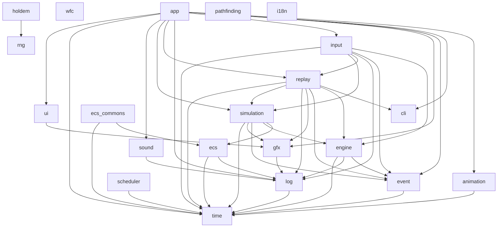

# Architecture

## Layering

The system is a set of small, single-purpose libraries under `src/libs/`, composed by applications under `src/apps/`.
Every module — library or app — owns its own `CMakeLists.txt`, `include/`, `src/` and `tests/`, and builds a `antwika_<module>` target aliased to `antwika::<module>`.
Public headers live at `include/antwika/<module>/`, so an include always reads `<antwika/simulation/EngineLoop.hpp>` and the module a type came from is visible at the include line.

Concrete frameworks live outside `src/` entirely, under `backends/`, one directory per framework.
Exactly one graphics backend and one input backend are compiled into a given build, chosen at configure time.
No file under `src/` may name SDL or raylib.

## The determinism rule

Everything else in the design follows from one requirement: loading a replay must reproduce the state a live run reached, proven by a test rather than asserted by inspection.

Three consequences do most of the work.

**The engine runs on a fixed timestep.**
`Engine::step()` takes a `time::Tick`, never a wall-clock delta, so nothing in the simulation can depend on how fast the machine ran.
Pacing a real-time app is a separate concern, handled by `simulation::TickPacer` outside the simulation.

**A replay stores only external input.**
Anything the engine regenerates deterministically on its own — `engine.tick` above all — is never written to the file.
Each app declares its self-generated event names, and a recorder drops them.
The rule extends downward: a click is recorded, but the tile that click placed is not, because the tile is regenerated from the click.

**Translation happens inside the tick path, downstream of the recorder.**
An input event becomes application meaning in a *sink* that runs during the tick, never in a renderer and never in a backend.
That is why the camera in `apps/game` is simulation state rather than render state: which cell a pixel means depends entirely on the camera, so a renderer-owned camera would leave a replay resolving recorded clicks against a different view.

Rendering is the mirror image of the same rule: it is a write-only projection of state and never feeds back into the loop.
`antwika::gfx` offers no pixel read-back, no render target and no screenshot, so there is no route by which a picture could influence a simulation.

## The tick loop

`simulation::EngineLoop` is the one code path shared by live and replay runs.
Each tick it asks an `ITickSource` for that tick's events, dispatches them through a `TickedEventDispatcher`, then steps the engine.

```mermaid
sequenceDiagram
    participant Loop as EngineLoop
    participant Src as ITickSource
    participant Disp as TickedEventDispatcher
    participant Sinks as ITickEventSink chain
    participant Eng as IEngine

    Loop->>Src: eventsFor(tick)
    Src-->>Loop: events for this tick
    Loop->>Disp: dispatch(each event)
    Disp->>Sinks: handle(TickEvent)
    Note over Sinks: recorder, then app sinks<br/>that translate input into meaning
    Loop->>Eng: step(tick)
    Eng->>Disp: dispatch(engine.tick)
    Loop->>Loop: stop requested?
```

Live and replay differ **only** in what implements `ITickSource`.
A replayed run uses `ReplaySource`, fed from a file by `ReplayReader`.
A live run uses `input::LiveInputSource` over an input backend, usually wrapped in decorators and in `WindowInputSource` so that closing a window arrives as ordinary replay input rather than short-circuiting the loop.
This is what makes a replay reproduce state by construction rather than by convention.

## Two ways an app holds state

The engine has no opinion about application state.

- A plain value folded by an `ITickEventSink` the app owns — `apps/game`'s `GameState` and its `GameStateReducer` are the example.
- An `antwika::ecs::World` of entities and components advanced by `ISystem`s — `apps/life` and `apps/task_worker` do this.

Both are driven from the same event stream, so the choice is per app rather than per engine.

## Library dependency graph

Arrows point from a library to what it links.



`wfc`, `rng`, `pathfinding`, `i18n` and `cli` have no `antwika` dependencies at all: all five are standalone libraries.
`holdem` has exactly one, `rng`, for the shuffle's bits.

Two edges deserve a note.
`simulation` links `ecs` for `TickPacer` (which is an `ecs::ISystem`) and `gfx` for `WindowInputSource`; `replay` links `gfx` for the `gfx::Size` a replay records its canvas as, and `simulation` because `ReplaySource` implements its seam.
`input` links `simulation` because every source it offers is an `ITickSource` — and therefore has `gfx` in its transitive link set, even though the rule that `input` does not depend on `gfx` still holds.
That rule is about the source, not the link line: no file under `src/libs/input` includes a `<antwika/gfx/...>` header or names a `gfx::` type.
This was reviewed and accepted rather than overlooked, so finding `gfx` in `antwika_input`'s transitive links is not a violation.

## Errors

One exception type per failure category, each deriving from `std::runtime_error` and each catchable on its own: `ReplayFormatError`, `SchemaVersionError`, `EngineLoopError`, `CommandLineError`, `EcsError`, `EcsCommonsError`, `SchedulerError`, `WfcError`, `GfxError`, `InputError`, `SoundError`, `AnimationError`, `PathfindingError`, `FramePacingError`, and in `holdem` a family of `IllegalActionError`, `TableStateError`, `CardFormatError`, `DeckExhaustedError` and `HandEvaluationError`.
Apps add their own in the same shape.

`SchemaVersionError` is the one that narrows another rather than standing beside it: it is a `ReplayFormatError` restricted to the single cause a caller may want to word differently, a document this build cannot bring to the current schema version.

## Further reading

- [`blog/001-building-a-deterministic-replay-system.md`](../blog/001-building-a-deterministic-replay-system.md) — the replay design.
- [`blog/003-an-entity-component-system-with-nowhere-to-hide-a-mutation.md`](../blog/003-an-entity-component-system-with-nowhere-to-hide-a-mutation.md) — the ECS.
- [`blog/012-a-window-that-cant-talk-back.md`](../blog/012-a-window-that-cant-talk-back.md) — hanging rendering off the loop without letting it feed back in.
- [`blog/013-the-camera-is-simulation-state.md`](../blog/013-the-camera-is-simulation-state.md) — why the camera is not render state.
- [`REQUIREMENTS.md`](../REQUIREMENTS.md) — every one of these constraints, stated as a requirement.
